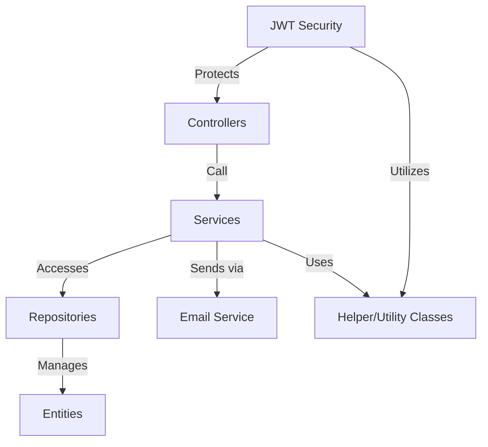
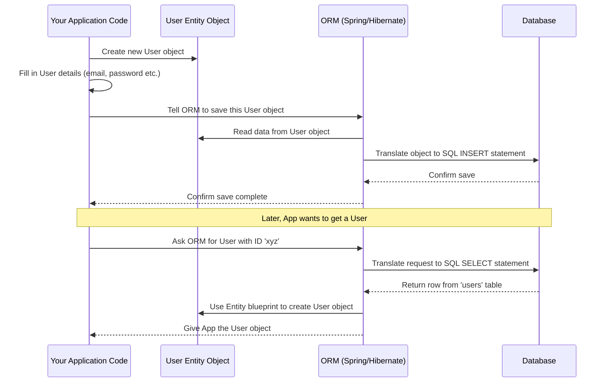
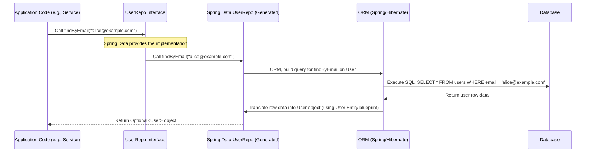
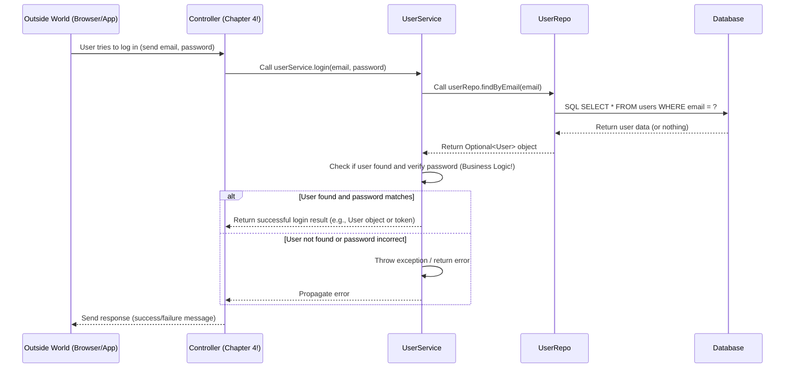
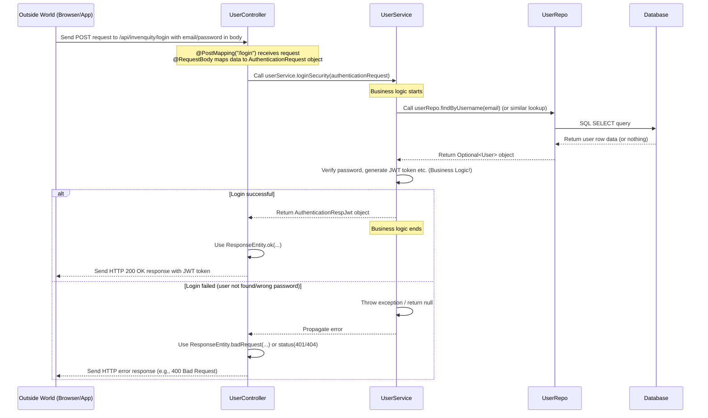
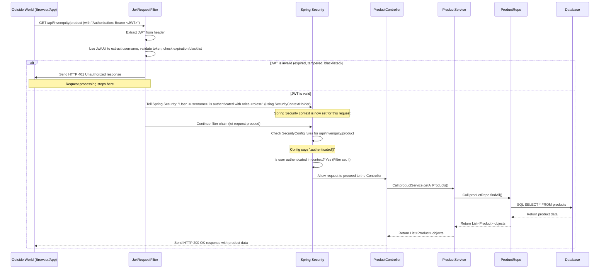
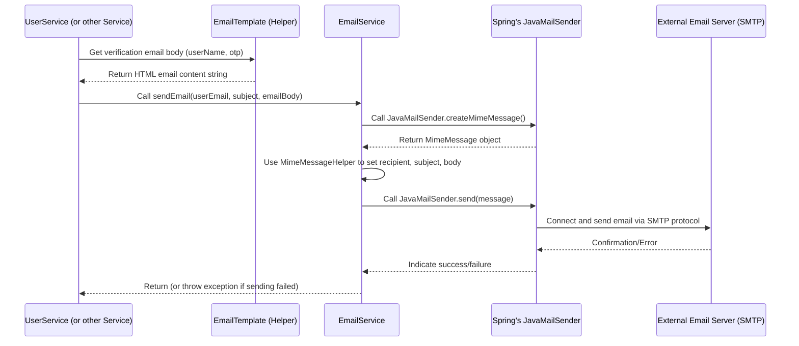
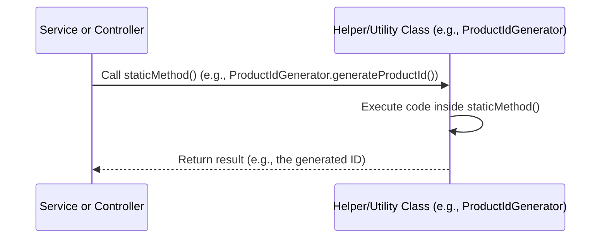

# Invenquity

<p align="center">
  
  
  
  
  
</p>

Invenquity is an **inventory management system** that helps businesses *track products*, manage *users* (including registration, login, and profiles), handle *subscriptions*, and manage *customer contact messages*. It includes features for notifying admins about low stock and uses **JWT security** for API protection and an **email service** for notifications and verification.

<p align="center">
  
</p>

## Visual Overview



## Chapters

1. [Entities
](01_entities_.md)
2. [Repositories
](02_repositories_.md)
3. [Services
](03_services_.md)
4. [Controllers
](04_controllers_.md)
5. [JWT Security
](05_jwt_security_.md)
6. [Email Service
](06_email_service_.md)
7. [Helper/Utility Classes
](07_helper_utility_classes_.md)

---


# Chapter 1: Entities

Welcome to the Invenquity tutorial! In this first chapter, we'll start with the absolute basics: how our application understands and organizes the information it needs to manage, like users, products, and subscriptions.

Imagine you're setting up a simple inventory system on index cards. For each *type* of item you track, you'd design a different type of card.

*   For a **Product**, you might need fields for: Name, Price, Quantity, Description.
*   For a **User**, you might need fields for: Name, Email, Password, Address.
*   For a **Subscription**, you might need fields for: User Email, Amount Paid, Date Subscribed.

These "index card designs" are exactly what we call **Entities** in Invenquity (and in many software development systems).

## What are Entities?

At their core, Entities are the **blueprints** for the main pieces of data in our system. They define:

1.  **What kind of data** an item holds (e.g., a Product has a name, price, quantity).
2.  **How this data is structured**.

Think of an Entity as a template. You can create many specific "items" (like a specific product "Laptop Model X" or a specific user "Alice") using that template, but the template itself defines the structure.

A key thing to understand is that **Entities directly map to tables in our database**. So, if we have a `Product` Entity blueprint, it corresponds to a `products` table in the database. Each individual product item we create (like "Laptop Model X") becomes a row in that `products` table.

## Let's Look at Some Entity Blueprints

In Java code, we define these blueprints as classes. Let's look at the `User` entity blueprint:

```java
package com.inventorymanagementsystem.server.entities;

import jakarta.persistence.Entity;
import jakarta.persistence.Id;
import jakarta.persistence.Table;
import lombok.Getter;
import lombok.Setter;
// ... other imports and annotations skipped for simplicity

@Getter // Helps get data from the User object
@Setter // Helps set data on the User object
@Entity // Tells the system: "This is a blueprint for a database entity!"
@Table(name = "users") // Tells the system: "This blueprint maps to the 'users' table in the database!"
public class User {
    @Id // Tells the system: "This is the unique identifier for each User!"
    private String id;

    private String email;
    private String username;
    private String password;
    // ... other fields like first_name, last_name, etc. skipped for brevity

    // ... other complex relationships skipped for brevity
}
```

*   The `@Entity` annotation is crucial. It tells the framework (Spring Data JPA, which works with Hibernate under the hood) that this `User` class is a blueprint for data that will be stored in the database.
*   The `@Table(name = "users")` annotation explicitly links this `User` class to a specific table named `users` in our database.
*   The variables inside the class (`id`, `email`, `username`, `password`, etc.) are the **fields** of our Entity. These fields correspond to the **columns** in the `users` database table.
*   The `@Id` annotation tells the system that the `id` field is the unique key for each row in the `users` table. Every user will have a different, unique `id`.

Here's another example, the `Product` entity blueprint:

```java
package com.inventorymanagementsystem.server.entities;

import jakarta.persistence.Column;
import jakarta.persistence.Entity;
import jakarta.persistence.Id;
import jakarta.persistence.Table;
import lombok.Getter;
import lombok.Setter;
// ... other imports and annotations skipped for simplicity

@Entity // This is a database entity blueprint!
@Table(name = "products") // This maps to the 'products' table!
@Getter
@Setter
public class Product {
    @Id // Unique identifier for each product
    private String id;

    private String productCategory;
    private String productName;

    @Column(unique = true, nullable = false) // Special constraints for skuCode
    private String skuCode;
    private Double price;
    private Integer quantity;
    // ... other fields like description, createdAt, etc. skipped

    // ... relationships skipped
}
```

Again, `@Entity` and `@Table` map the `Product` class to the `products` table. The fields like `productName`, `skuCode`, `price`, and `quantity` become columns in that table. The `@Id` marks the unique `id`.

Notice the `@Column` annotation on `skuCode`. This adds extra rules: the `skuCode` must be unique across all products and cannot be empty (`nullable = false`).

## What About Classes That Aren't Entities?

You might have seen a class like `TempUser.java` in the project code:

```java
package com.inventorymanagementsystem.server.entities;

import lombok.AllArgsConstructor;
import lombok.Getter;
import lombok.NoArgsConstructor;
import lombok.Setter;
// ... other imports skipped

@Getter
@Setter
@AllArgsConstructor
@NoArgsConstructor
public class TempUser {

    private String id;
    private String email;
    // ... other fields

    private String otp;
    private LocalDateTime otpGeneratedTime;
}
```

This `TempUser` class looks similar to the `User` class, but **it does NOT have the `@Entity` annotation**. This means `TempUser` is **not** a blueprint for a database table. It's just a regular Java class used to hold temporary data while the program is running, perhaps during a user registration process before the user is fully saved to the database.

This highlights the specific role of `@Entity` – it's the marker that says, "This class represents a fundamental data item that lives in our database."

## How Entities Work with the Database (A Sneak Peek)

So, we have these blueprints (Entity classes) and the actual database tables. How do they connect?

When you run the application, the system (Spring Data JPA/Hibernate) looks for all classes marked with `@Entity`. It uses these blueprints to understand the structure of your data.

If the database tables don't exist yet, based on your application's configuration, it can even *create* those tables for you based on the fields and annotations (`@Id`, `@Column`, etc.) in your Entity classes!

When you want to save a new user, you'll create a `User` object in your Java code, fill in its fields (like setting the email, username, password), and then tell the system to save it. The system uses the `User` Entity blueprint to know how to translate that `User` object into a new row in the `users` table in the database.

Similarly, when you want to retrieve a user, you'll ask the system for the user with a specific ID or email. The system will look in the `users` table, find the corresponding row, and use the `User` Entity blueprint to translate that database row back into a `User` object in your Java code that you can then work with.

Here's a very simplified look at this interaction:



This diagram shows that your application code primarily interacts with the Entity objects (like a `User` object). The ORM (Object-Relational Mapper), powered by `@Entity` and other annotations, is the "translator" between your Java objects and the database tables.

## Conclusion

Entities are the foundational layer for data in Invenquity. They are Java classes marked with `@Entity` that serve as blueprints defining the structure of the main data pieces (users, products, etc.) and mapping them directly to database tables. Understanding Entities is the first step to seeing how our application stores and manages information.

In the next chapter, we'll learn how to *actually* perform actions like saving a new user or finding an existing product using something called **Repositories**.


---


# Chapter 2: Repositories

Welcome back! In the last chapter, [Entities](01_entities_.md), we learned about the fundamental building blocks of our data – the blueprints like `User` and `Product` that map directly to database tables. We saw how these blueprints define the structure of the information we want to store.

But knowing *what* data looks like isn't enough. We need a way to *do* things with that data: save a new user, find an existing product, update a user's password, or delete an old subscription.

Imagine your [Entities](01_entities_.md) are like the blueprints and finished physical books in a massive library. How do you actually get a specific book off the shelf? You need a system!

## The Problem: Talking to the Database Directly

We *could* write code everywhere in our application that directly talks to the database using complex commands (SQL queries). For example, to find a user by email, you might write something like `SELECT * FROM users WHERE email = '...'`. To save a new user, it would be `INSERT INTO users (id, email, ...) VALUES ('...', '...', ...)`.

Doing this has a few problems:

1.  **It's messy:** Database commands are often detailed and not very easy to read within your application's main logic.
2.  **It's repetitive:** You'd be writing `SELECT` and `INSERT` commands all over the place.
3.  **It's hard to change:** If you ever wanted to switch database types or change how data is stored slightly, you'd have to find and update SQL commands in *many* different files.
4.  **It mixes concerns:** Your application logic (like "what happens when a user logs in") gets mixed up with database details ("how do I fetch the user record?").

We need a cleaner way to handle all the database interactions.

## Enter: Repositories!

This is where **Repositories** come in. Repositories act as a dedicated layer between your application's core logic and the database. Their job is simple: **provide a clear way to perform common database operations on specific [Entities](01_entities_.md)**.

Think of a Repository as a **specialized librarian** for a particular type of book (an [Entity](01_entities_.md)).

*   You don't tell the librarian *how* to find the book (they handle the shelf numbers, indexing, etc.).
*   You just tell them *what* you need (e.g., "Find me the user book with this email address").
*   They handle the details of going into the database (the library), finding the right record (the book), and bringing it back to you as a neat [Entity](01_entities_.md) object.

In the Invenquity project, Repositories are typically defined as **interfaces** in Java. An interface is like a contract – it defines *what* methods are available but doesn't contain the *code* for how they work. The framework (Spring Data JPA) automatically provides the actual implementation code for these interfaces!

## Using Repositories: A Simple Example (User)

Let's look at the `UserRepo.java` file we saw snippets of earlier:

```java
package com.inventorymanagementsystem.server.repositories;

import java.util.Optional;
import org.springframework.data.jpa.repository.JpaRepository;
import com.inventorymanagementsystem.server.entities.User; // Import our User Entity

// ... other imports skipped

public interface UserRepo extends JpaRepository<User, String> {
    // Spring Data JPA automatically provides methods here!

    // We can add custom methods too:
    Optional<User> findByEmail(String email);
    Optional<User> findByUsername(String username);
    // ... other custom methods skipped for brevity
}
```

*   `public interface UserRepo`: This declares that `UserRepo` is an interface.
*   `extends JpaRepository<User, String>`: This is the magic part provided by Spring Data JPA. By extending `JpaRepository`, our `UserRepo` interface instantly inherits a whole set of common database operations for the `User` [Entity](01_entities_.md)!
    *   The first part `<User, ...>` tells it *which* [Entity](01_entities_.md) this Repository is for (`User`).
    *   The second part `<..., String>` tells it the data type of the `@Id` field in the `User` [Entity](01_entities_.md) (which is `String` for the `User`'s `id`).

**What methods do we get for free?**

Because `UserRepo` extends `JpaRepository<User, String>`, we automatically get methods like:

*   `save(User user)`: To save a new `User` or update an existing one.
*   `findById(String id)`: To find a `User` by their unique ID.
*   `findAll()`: To get a list of *all* users.
*   `delete(User user)`: To remove a `User` record.
*   `count()`: To get the total number of users.

And many more!

**What about the custom methods?**

Look at `Optional<User> findByEmail(String email);` and `Optional<User> findByUsername(String username);`. We just declared these methods! How does Spring know what to do?

Spring Data JPA is smart! For many common patterns like "find by a field," it can automatically create the necessary database query based on the method name.

*   `findByEmail(String email)`: Spring sees "findBy" and "Email" (which matches a field in our `User` [Entity](01_entities_.md)). It automatically generates the SQL query `SELECT * FROM users WHERE email = ?` and handles executing it and returning the result as a `User` object (wrapped in `Optional` because a user might not be found).
*   `findByUsername(String username)`: Similarly, this generates `SELECT * FROM users WHERE username = ?`.

This "query derivation" from method names is a powerful feature of Spring Data JPA that saves us from writing a lot of boilerplate code.

## Using the Repository in Your Code

Now, how would another part of your application (like a [Service](03_services_.md) class, which we'll cover next) *use* this `UserRepo`? You'd "inject" it and call its methods:

```java
// Inside a Service or another class that needs to work with Users

import com.inventorymanagementsystem.server.repositories.UserRepo;
import com.inventorymanagementsystem.server.entities.User; // Import User Entity
import java.util.Optional;

// ... other imports and annotations skipped

public class SomeUserService {

    // Spring handles giving us an instance of UserRepo here
    private final UserRepo userRepo;

    // Constructor to receive the injected UserRepo
    public SomeUserService(UserRepo userRepo) {
        this.userRepo = userRepo;
    }

    // Example method to save a new user
    public User createNewUser(User newUser) {
        // We just call the 'save' method provided by JpaRepository
        User savedUser = userRepo.save(newUser);
        return savedUser; // The savedUser might have its ID set now
    }

    // Example method to find a user by email
    public Optional<User> getUserByEmail(String email) {
        // We call the custom method we defined in UserRepo
        Optional<User> foundUser = userRepo.findByEmail(email);
        return foundUser; // Returns Optional.of(User) if found, Optional.empty() otherwise
    }

    // Example method to find a user by ID
    public Optional<User> getUserById(String userId) {
        // We call the 'findById' method provided by JpaRepository
        Optional<User> foundUser = userRepo.findById(userId);
        return foundUser;
    }
}
```

Notice how clean this is! The `SomeUserService` class doesn't know *how* the user is saved or found; it just knows *that* it can call `userRepo.save()` or `userRepo.findByEmail()` and get the expected result. This makes the code easier to read, test, and maintain.

## How it Works Behind the Scenes

Let's visualize the process using our librarian analogy:



When your application code calls a method on the `UserRepo` interface, Spring Data JPA intercepts this call. Because you extended `JpaRepository`, Spring Data has automatically generated a class behind the scenes that implements the `UserRepo` interface. This generated class contains the code to translate your method call (like `findByEmail`) into the appropriate database operations (like an SQL `SELECT` query) using the ORM (Object-Relational Mapper, like Hibernate, which works with the [Entity](01_entities_.md) definition). The ORM then talks to the database, gets the result, and translates it back into the correct [Entity](01_entities_.md) object (`User` in this case) before returning it through the Repository interface back to your application code.

You interact with the simple, clean interface (`UserRepo`), and Spring Data JPA and the ORM handle all the complex database interaction details for you.

## Repositories for Other Entities

Just like `User` has `UserRepo`, most other [Entities](01_entities_.md) in Invenquity have their own corresponding Repositories:

| Entity      | Repository Interface       | Primary Key Type | Purpose                                      |
| :---------- | :------------------------- | :--------------- | :------------------------------------------- |
| `User`      | `UserRepo`                 | `String`         | Manage User data (find, save, login checks) |
| `Product`   | `ProductRepo`              | `String`         | Manage Product data (find by SKU, name, etc.) |
| `Subscription`| `SubscriptionRepo`       | `String`         | Manage Subscription data                     |
| `Contact`   | `ContactRepo`              | `String`         | Manage Contact messages                      |
| `Notification`| `NotificationRepo`       | `String`         | Manage Notifications                         |
| `ForgotPassword`| `ForgotPasswordRepo`   | `Integer`        | Manage Forgot Password requests              |

Let's look at `ProductRepo.java` briefly:

```java
package com.inventorymanagementsystem.server.repositories;

import java.util.List;
import org.springframework.data.jpa.repository.JpaRepository;
import org.springframework.data.jpa.repository.Query; // For custom queries
import org.springframework.data.repository.query.Param; // For named parameters

import com.inventorymanagementsystem.server.entities.Product; // Import Product Entity

public interface ProductRepo extends JpaRepository<Product, String> {
    // Example of methods using query derivation: (not shown in snippet but possible)
    // Optional<Product> findBySkuCode(String skuCode);

    // Examples using custom @Query annotation
    @Query("SELECT p FROM Product p WHERE LOWER(p.skuCode) = LOWER(:skuCode)")
    List<Product> findBySkuCodeIgnoreCase(@Param("skuCode") String skuCode);

    @Query("SELECT p FROM Product p WHERE LOWER(p.productName) = LOWER(:productName)")
    List<Product> findByProductNameIgnoreCase(@Param("productName") String productName);

    // ... other custom queries
}
```

Here, you see it extends `JpaRepository<Product, String>`. It gets all the basic `save`, `findById`, etc., methods for `Product`. It also defines custom methods like `findBySkuCodeIgnoreCase` using the `@Query` annotation. This annotation allows you to write custom database queries (using a language called JPQL, which is similar to SQL but works with Entity names and fields instead of table/column names) when Spring Data's automatic query derivation isn't sufficient. The `@Param` annotation helps map method parameters to names used in the `@Query`.

This shows the flexibility: use inherited methods for basic operations, use query derivation for simple field-based lookups, and use `@Query` for more complex or custom queries.

## Benefits of Using Repositories

Using Repositories provides significant advantages:

| Benefit          | Description                                                                 |
| :--------------- | :-------------------------------------------------------------------------- |
| **Clean Code**   | Application logic stays focused on business rules, not database commands.   |
| **Abstraction**  | Hides database details; your code interacts with objects, not tables/rows.  |
| **Reusability**  | Database operations are defined once per [Entity](01_entities_.md).         |
| **Maintainability**| Easier to update or change database logic in one place (the Repository).  |
| **Testability**  | Repositories can be easily "mocked" (simulated) for testing purposes.       |

## Conclusion

Repositories are a crucial layer in Invenquity, acting as the gatekeepers for database access. They provide a clean, object-oriented way to interact with our [Entities](01_entities_.md) (like `User` or `Product`) without writing direct database queries everywhere. By extending `JpaRepository`, we get many common operations for free, and Spring Data allows us to define custom queries easily.

Now that we know how to represent our data ([Entities](01_entities_.md)) and how to perform database operations on them using Repositories, the next step is to bring this all together to implement the actual logic of our application – things like user registration, product management, etc. This is the role of **Services**.


---


# Chapter 3: Services

Welcome back to the Invenquity tutorial! In the previous chapters, we built our foundation:
*   In [Chapter 1: Entities](01_entities_.md), we learned about **Entities**, which are the blueprints for our data, defining the structure of things like users and products and mapping directly to database tables.
*   In [Chapter 2: Repositories](02_repositories_.md), we discovered **Repositories**, which act like specialized librarians, providing a clean way to perform basic database operations (saving, finding, deleting) on our [Entities](01_entities_.md) without writing direct database code everywhere.

Now, imagine you need to perform a more complex task than just saving a single item. For example, what happens when a new user signs up?
1.  You need to check if a user with that email already exists.
2.  You need to take their password and securely scramble it (hash it).
3.  You might need to generate a unique ID for the user.
4.  You need to save this new user's information to the database.
5.  Maybe you need to send them a welcome email or a verification code.

Saving the user is a Repository job (`userRepo.save()`). Checking if they exist is also a Repository job (`userRepo.findByEmail()`). But the overall process – coordinating these steps, applying business rules (like "email must be unique"), hashing the password, sending the email – isn't just one simple database action.

This is where the **Service layer** comes in!

## What are Services?

Think of Services as the **department managers** of your application. They:

*   Receive requests to perform specific actions (like "register a new user," "add a product," "process a subscription").
*   Know the step-by-step process and the **business rules** needed to complete that action.
*   Orchestrate the task, which often involves using **[Repositories](02_repositories_.md)** to interact with the database.
*   May also use other helper classes or even other Services to get the job done.
*   They encapsulate the "how-to" for specific application features.

In short, the **Service layer contains the core business logic** of your application. It connects the outside world (which asks for things to be done) with the data storage ([Repositories](02_repositories_.md) and [Entities](01_entities_.md)).

Just like [Repositories](02_repositories_.md), Services in Java are typically defined as **interfaces** first, followed by **implementation classes**. The interface defines *what* actions the Service can perform, and the implementation class contains the actual code for *how* it performs them.

## Let's Look at a Service: The UserService

Let's revisit our "register a user" example and look at the `UserService`. First, the interface (`UserService.java`):

```java
package com.inventorymanagementsystem.server.service;

import java.util.List;
import java.util.Optional;

import com.inventorymanagementsystem.server.dto.request.AuthenticationRequest;
import com.inventorymanagementsystem.server.dto.response.UserDTO;
import com.inventorymanagementsystem.server.entities.User; // Uses the User Entity

public interface UserService {
    // These are the actions related to Users that other parts of the app can request:
    User saveUser(User user); // Basic save
    Optional<User> getUserById(String id); // Find by ID
    // ... many other methods ...

    // Business logic specific methods:
    boolean isUserExistByEmail(String email);
    Optional<User> getUserByEmail(String email);
    Optional<User> getUserByUsername(String username);

    User register(User user); // The complex registration process!
    void verify(String email, String otp); // Email verification logic
    User login(String email, String password); // Login logic
    // ... more methods ...
}
```

This interface tells us that the `UserService` is responsible for managing users, and it provides methods like `register`, `verify`, `login`, `getUserByEmail`, etc. These are the **actions** we can perform related to users. Notice how they are higher-level actions than just "save this entity".

Now, let's look at a simplified version of how the `register` method is implemented in `UserServiceImpl.java`:

```java
package com.inventorymanagementsystem.server.service.Impl;

// ... imports ...
import org.springframework.stereotype.Service; // Marks this as a Service class

import com.inventorymanagementsystem.server.entities.User; // Uses User Entity
import com.inventorymanagementsystem.server.repositories.UserRepo; // Uses User Repo
// Import other helpers/services needed...
import com.inventorymanagementsystem.server.helper.PasswordBcrypt;
import com.inventorymanagementsystem.server.helper.GenerateOtp;
import com.inventorymanagementsystem.server.service.EmailService; // Uses Email Service
// ... more imports ...

@Service // Tells Spring: "This is a Service!"
public class UserServiceImpl implements UserService {

    // We need our UserRepo (the librarian) and EmailService (another department)
    private final UserRepo userRepo;
    private final EmailService emailService;

    // Spring automatically gives us these when the Service is created
    public UserServiceImpl(UserRepo userRepo, EmailService emailService) {
        this.userRepo = userRepo;
        this.emailService = emailService;
    }

    @Override
    public User register(User user) {
        // Step 1: Check if user already exists (Business Rule!)
        // Use the Repository (the librarian) to check the database
        Optional<User> existingUser = userRepo.findByEmail(user.getEmail());
        if (existingUser.isPresent() && existingUser.get().isEmailVerified()) {
            throw new RuntimeException("User already exists and verified");
        }
        // Check username too... (more logic skipped)

        // Step 2: Prepare temporary data (might involve helpers)
        // Generate OTP (using a helper class)
        String otp = GenerateOtp.generateOtp();
        // Store temporarily, perhaps in memory or a temporary table
        // (Simplified: imagine saving it linked to the email for verification)

        // Step 3: Send verification email (Use another Service!)
        // We tell the EmailService department to send the email
        emailService.sendEmail(user.getEmail(), "Verify your email", "Your OTP is: " + otp);

        // Return minimal user info, full user isn't saved yet until verified
        // (Simplified: return just the email, username etc.)
        return User.builder()
                .email(user.getEmail())
                .username(user.getUsername())
                // ... other fields ...
                .build();
    }

    @Override
    public void verify(String email, String otp) {
        // Step 1: Retrieve temporary user data
        // (Look up the temporarily stored user by email)

        // Step 2: Check OTP and expiry (Business Rules!)
        // If OTP is wrong or expired, throw error

        // Step 3: If successful, process for permanent storage
        // Generate permanent User ID (using a helper)
        String userId = "generated_id"; // Simplified
        // Hash the password (using a helper)
        String hashedPassword = PasswordBcrypt.hashPassword("temp_password"); // Simplified

        // Create the final User Entity object
        User newUser = User.builder()
                .id(userId)
                .email(email)
                .password(hashedPassword)
                // ... copy other details from temporary user ...
                .isEmailVerified(true) // Mark as verified
                .role("SALESPERSON") // Set default role
                // ... timestamps etc. ...
                .build();

        // Step 4: Save the verified user to the database
        // Use the Repository (the librarian) to save the User Entity
        userRepo.save(newUser);

        // Step 5: Clean up temporary data
        // (Remove the temporary user from storage)
    }

    // ... other methods like login(), getUserById(), etc. would be implemented here ...
}
```

*   The `@Service` annotation tells the Spring framework that this class is a Service and should be managed by Spring.
*   It **depends on** `UserRepo` and `EmailService` (and other things like helper classes). Spring automatically provides instances of these when it creates the `UserServiceImpl`, which is called **Dependency Injection**.
*   The `register` method shows how it orchestrates multiple steps: checking existence (using `userRepo`), preparing data (using helpers/temporary storage), and sending email (using `emailService`).
*   The `verify` method continues the process, retrieving temp data, applying verification logic, hashing password (using a helper), creating the final [Entity](01_entities_.md) object, and finally using `userRepo.save()` to persist it.

This implementation class contains the actual logic for the methods declared in the `UserService` interface.

## How Services Connect Things

Let's visualize the flow for a user trying to log in, starting from the web request. This involves all the layers we've discussed so far:



1.  An external request (from a browser or mobile app) arrives, handled by a **[Controller](04_controllers_.md)** (the "Front Desk").
2.  The **[Controller](04_controllers_.md)** determines *what* action is needed (e.g., "login") and delegates the *how* to the appropriate **Service** (`UserService`).
3.  The **Service** (`UserService`) contains the business logic for logging in: "Find the user by email, then check if the provided password matches the stored (hashed) password."
4.  To find the user, the **Service** calls the **Repository** (`UserRepo`).
5.  The **Repository** translates this request into a database query.
6.  The **Database** executes the query and returns the data to the **Repository**.
7.  The **Repository** converts the data back into a [User Entity](01_entities_.md) object and returns it to the **Service**.
8.  The **Service** then performs the password check (business logic).
9.  Based on the result, the **Service** returns a success or failure indication back to the **[Controller](04_controllers_.md)**.
10. The **[Controller](04_controllers_.md)** formats the final response and sends it back to the outside world.

This flow clearly shows how the Service layer orchestrates the process, acting as the central point for business logic and coordinating calls to lower layers like Repositories.

## Other Services in Invenquity

Just like `UserService`, Invenquity has other services responsible for managing specific parts of the application:

*   **`ProductService`**: Handles adding, updating, fetching, and deleting `Product` [Entities](01_entities_.md). It also contains logic like checking product quantities and potentially notifying admins when stock is low (`checkProductQuantity`, `notifyAdmins`). It uses the `ProductRepo` and `UserRepo` (to link products to users) and the `EmailService` (for notifications).
*   **`SubscriptionService`**: Manages `Subscription` [Entities](01_entities_.md), handling logic like checking if an email is already subscribed or saving new subscriptions. It uses `SubscriptionRepo`.
*   **`NotificationService`**: Likely handles retrieving and managing user notifications. It uses `NotificationRepo`.
*   **`ContactService`**: Manages contact messages, saving new ones, retrieving them, and sending replies. It uses `ContactRepo` and `EmailService`.

Each Service focuses on a specific domain or set of related tasks, making the codebase organized and easier to understand.

## Benefits of the Service Layer

Having a dedicated Service layer provides several advantages:

| Benefit                  | Description                                                                                                |
| :----------------------- | :--------------------------------------------------------------------------------------------------------- |
| **Business Logic Centralization** | All related business rules and logic for a feature live in one place (the Service), not scattered around. |
| **Abstraction**          | Hides the details of data access ([Repositories](02_repositories_.md)) and other operations from the layer above ([Controllers](04_controllers_.md)). |
| **Reusability**          | Complex workflows can be called from multiple [Controllers](04_controllers_.md) or even other Services.      |
| **Testability**          | Services can be tested independently by providing "mock" (simulated) [Repositories](02_repositories_.md) and other dependencies. |
| **Maintainability**      | Changes to business rules or database interactions are often limited to the relevant Service and its Repositories. |
| **Decoupling**           | Layers are less dependent on each other (Service doesn't need to know *how* Repo saves, Repo doesn't know *why* Service needs to save). |

## Conclusion

The Service layer is where the real work of the application happens. It acts as the bridge between the external requests and the data storage, encapsulating the business rules and orchestrating the steps needed to perform complex actions like user registration, product management, or handling subscriptions. By using Repositories to interact with the database and potentially collaborating with other Services or helper classes, Services keep our core application logic clean, organized, and maintainable.

Now that we understand how [Entities](01_entities_.md) represent data, [Repositories](02_repositories_.md) manage database access, and Services implement the business logic, the next step is to learn about the layer that receives requests from the outside world and calls upon the Services to get things done: **Controllers**.


---


# Chapter 4: Controllers

Welcome back, future Invenquity masters! So far in our journey, we've explored the foundational pieces of our application:
*   In [Chapter 1: Entities](01_entities_.md), we defined the blueprints for our data (like `User` and `Product`) which map to database tables.
*   In [Chapter 2: Repositories](02_repositories_.md), we learned how to interact with the database to save, find, and delete those [Entities](01_entities_.md).
*   In [Chapter 3: Services](03_services_.md), we saw how the core business logic lives, orchestrating actions and using [Repositories](02_repositories_.md) to get things done (like registering a user or adding a product).

But how does the outside world – a user using a web browser or a mobile app – actually *trigger* any of this? How does the application know when someone wants to log in, add a product, or view their profile?

Imagine our application is a building with different departments ([Services](03_services_.md)) and filing systems ([Repositories](02_repositories_.md) for [Entities](01_entities_.md)). Someone walks up to the building needing something done. They don't go straight to the "User Registration Department" ([UserService]) or the "Product Filing Clerk" ([ProductRepo]). They go to the **front desk**!

## What are Controllers?

This "front desk" or **reception area** of our application is precisely the role of **Controllers**.

Controllers are the **entry points** into our application for requests coming from users or other systems over the internet (specifically via HTTP, the language of the web).

Their main jobs are:

1.  **Receive the Request:** They listen for incoming requests at specific web addresses (URLs).
2.  **Understand the Request:** They figure out *what* the user wants to do (e.g., "add a product", "get user details") and *what data* they sent (e.g., the product's name, price, or the user's ID).
3.  **Delegate to the Service:** They pass the request (and any necessary data) to the appropriate **[Service](03_services_.md)** (the "department manager") to handle the actual business logic.
4.  **Receive the Result:** They get the outcome of the operation from the [Service](03_services_.md).
5.  **Prepare and Return the Response:** They format the result into a suitable response (like data in JSON format, a success message, or an error code) and send it back to the user's browser or app.

Controllers **do NOT** contain business logic themselves. They act purely as the receptionist, directing traffic and handling the communication format. The *how* of adding a product or finding a user is handled by the [Service](03_services_.md).

## How Controllers Work in Invenquity (Spring Boot)

In our Invenquity project, which is built using Spring Boot, Controllers are standard Java classes marked with special annotations that tell Spring: "Hey, this class is a Controller and handles web requests!"

Let's look at a simplified example of a Controller that handles Product-related requests, inspired by the `ProductController.java` file:

```java
package com.inventorymanagementsystem.server.controller;

import java.util.List;

import org.springframework.beans.factory.annotation.Autowired;
import org.springframework.http.ResponseEntity; // Used for building responses
import org.springframework.web.bind.annotation.*; // Contains @RestController, @RequestMapping, etc.

import com.inventorymanagementsystem.server.entities.Product; // Uses Product Entity
import com.inventorymanagementsystem.server.service.ProductService; // Calls the ProductService

@RestController // 1. Tells Spring: "This is a Controller that handles web requests!"
@RequestMapping("/api/invenquity/product") // 2. Sets the base path for ALL endpoints in this controller
public class ProductController {

    @Autowired // 3. Asks Spring to give us an instance of the ProductService
    private ProductService productService;

    // Endpoint to get ALL products
    // This method handles GET requests to /api/invenquity/product
    @GetMapping // 4. Maps GET requests to this specific method
    public ResponseEntity<List<Product>> getAllProducts() {
        try {
            // 5. Delegate to the Service layer to get the data
            List<Product> products = productService.getAllProducts();

            // 6. Prepare and return the response (HTTP 200 OK with the list of products)
            return ResponseEntity.ok(products);
        } catch (Exception e) {
            // 7. Handle errors and return an appropriate response (HTTP 500 Internal Server Error)
            return ResponseEntity.status(500).build(); // Or body(e.getMessage()) for details
        }
    }

    // Endpoint to add a new product
    // This method handles POST requests to /api/invenquity/product
    @PostMapping // 4. Maps POST requests to this specific method
    public ResponseEntity<Product> addProduct(@RequestBody Product product) { // 8. Get product data from the request body
        try {
            // 5. Delegate to the Service layer to add the product
            Product createdProduct = productService.addProduct(product);

            // 6. Prepare and return the response (HTTP 200 OK with the created product)
            return ResponseEntity.ok(createdProduct);
        } catch (Exception e) {
            // 7. Handle errors
            return ResponseEntity.status(500).build();
        }
    }

    // ... other methods like updateProduct, deleteProduct, getProductById/Sku/Name/Category ...
}
```

Let's break down the key parts of this `ProductController`:

1.  **`@RestController`**: This annotation marks the class as a Controller and also indicates that methods in this class should return data directly (like JSON or XML) rather than rendering a web page. This is common for building APIs (Application Programming Interfaces) that are used by front-end applications (like a React/Angular/Vue website or a mobile app).
2.  **`@RequestMapping("/api/invenquity/product")`**: This annotation sets the base URL path for all the "endpoints" defined within this Controller. Any method inside `ProductController` will have its specific path appended to this base path. So, if a method has `@GetMapping`, its full path is `/api/invenquity/product`. If another method has `@GetMapping("/{id}")`, its full path is `/api/invenquity/product/{id}`.
3.  **`@Autowired private ProductService productService;`**: This tells Spring, "I need an instance of the `ProductService` here." Spring's **Dependency Injection** automatically provides the correct `ProductServiceImpl` instance, so the Controller can easily call methods like `productService.getAllProducts()` or `productService.addProduct()`.
4.  **`@GetMapping` / `@PostMapping` / `@PutMapping` / `@DeleteMapping`**: These annotations map specific HTTP methods (GET, POST, PUT, DELETE) and URL paths to Java methods within the Controller.
    *   `@GetMapping`: Used for retrieving data (like viewing a list of products).
    *   `@PostMapping`: Used for creating new resources (like adding a new product).
    *   `@PutMapping`: Used for updating existing resources.
    *   `@DeleteMapping`: Used for removing resources.
    *   The paths for these mappings can be specified within the parentheses, like `@GetMapping("/{id}")`. If no path is specified, it uses the base path defined by `@RequestMapping`.
5.  **Calling the Service**: Inside the methods (`getAllProducts`, `addProduct`), you see the Controller calling the corresponding methods on the injected `productService`. This is the Controller delegating the actual work to the Service layer.
6.  **`ResponseEntity<?>`**: The methods return `ResponseEntity`. This is a Spring class that represents the entire HTTP response, including the status code (like 200 OK, 404 Not Found, 500 Internal Server Error), headers, and the response body (the data or message being sent back). `ResponseEntity.ok()` creates a response with status 200 OK. `ResponseEntity.status(500).build()` creates a response with status 500.
7.  **Error Handling**: Controllers often include basic error handling (like the `try-catch` blocks) to catch exceptions thrown by the Service layer and return appropriate HTTP error codes and messages to the client.
8.  **`@RequestBody` / `@PathVariable` / `@RequestParam`**: These annotations are used to extract data from the incoming HTTP request:
    *   `@RequestBody`: Used in methods that accept data in the request body (like `POST` or `PUT` requests). It automatically converts the incoming data (usually JSON) into a Java object (like `Product product` in the `addProduct` method).
    *   `@PathVariable`: Used to extract values from the URL path itself, like extracting the `id` from `/api/invenquity/product/{id}`.
    *   `@RequestParam`: Used to extract values from URL query parameters, like `?email=test@example.com&otp=123456`.

## The Request Flow Through the Layers

Let's revisit the login example flow from [Chapter 3: Services](03_services_.md) and put the Controller firmly at the start:



This diagram illustrates the journey of a login request:

1.  The **Outside World** sends an HTTP POST request to the `/api/invenquity/login` URL.
2.  The `UserController` (marked with `@RestController` and `@RequestMapping("/api/invenquity")`) listens for requests on its defined paths. The method annotated with `@PostMapping("/login")` matches this request.
3.  Spring automatically extracts the email and password from the request body using `@RequestBody` and creates an `AuthenticationRequest` object, passing it to the `createAuthenticationToken` method in the `UserController`.
4.  The `UserController` **delegates** the complex task of verifying the login credentials to the `UserService` by calling `userService.loginSecurity(...)`.
5.  The `UserService` executes the login **business logic**, which involves asking the `UserRepo` to find the user in the **Database**.
6.  Based on the outcome from the `UserService` (either a successful login with user details and a token, or an error), the `UserController` creates the final **`ResponseEntity`** object.
7.  The `ResponseEntity` is sent back as the HTTP response to the **Outside World**, containing either the requested data (like a JWT token for the user) or an error message and status code.

The Controller's role is clearly defined: receive, understand, delegate, format, and respond. It doesn't know *how* the login works, only *that* it should ask the `UserService` to handle it.

## Controllers in the Invenquity Project

Looking at the provided code snippets, you can see multiple Controller files, each responsible for a specific area of the application:

*   `UserController.java`: Handles general user actions like `/register`, `/verify`, `/login`, `/logout`, `/refresh-token`. It primarily uses the `UserService`.
*   `UserProfileController.java`: Handles administrative actions related to user profiles like fetching, updating, or deleting users by ID, username, or email. It also uses the `UserService`.
*   `ProductController.java`: Handles all operations related to Products (`/api/invenquity/product`), including adding, updating, getting, and deleting single or multiple products. It uses the `ProductService`.
*   `SubscriptionController.java`: Manages subscriptions (`/api/invenquity/subscription`), handling requests related to Stripe checkout sessions and subscription success logic. It uses `SubscriptionService` and `UserService`.
*   `ContactController.java`: Deals with contact messages (`/api/invenquity/contact`), saving new messages, retrieving them, and sending replies. It uses the `ContactService`.
*   `ForgotPasswordController.java`: Handles the forgotten password flow (`/api/invenquity/request-otp`, `/api/invenquity/verify-otp`). While it injects Repositories and an EmailService directly, it could also delegate this logic to a dedicated service class for better separation of concerns, but in this case, the logic is simple enough to reside here.

Each Controller is focused on a particular domain and exposes a set of related functionalities as distinct endpoints.

## Benefits of Using Controllers

Having a dedicated Controller layer offers significant benefits:

| Benefit              | Description                                                                      |
| :------------------- | :------------------------------------------------------------------------------- |
| **Clear Entry Points** | Provides well-defined URLs and methods for interacting with the application.       |
| **Separation of Concerns** | Keeps web interaction logic separate from business logic ([Services](03_services_.md)) and data access ([Repositories](02_repositories_.md)). |
| **Request Mapping**  | Easily maps different types of HTTP requests (GET, POST, etc.) and URLs to specific code. |
| **Input Handling**   | Simplifies extracting data from request bodies, paths, and query parameters.     |
| **Response Formatting**| Provides tools (`ResponseEntity`) to easily build and return standard HTTP responses (status codes, data). |
| **Testability**      | Controllers can be tested independently by "mocking" the [Services](03_services_.md) they depend on. |

## Conclusion

Controllers are the essential first point of contact for external requests in Invenquity. They act as the application's front desk, receiving requests, understanding what the user wants, delegating the actual work to the appropriate **[Service](03_services_.md)**, and formatting the final response to send back. By keeping Controllers focused on request handling and delegating business logic to [Services](03_services_.md), we maintain a clean, organized, and maintainable application structure.

Now that we understand how requests enter our system via Controllers and are processed by [Services](03_services_.md) and [Repositories](02_repositories_.md) interacting with [Entities](01_entities_.md), the next crucial topic is ensuring that only authorized users can access certain functionalities. This leads us to **JWT Security**.


---


# Chapter 5: JWT Security

Welcome back! In the previous chapters, we've built up the structure of our application:
*   [Chapter 1: Entities](01_entities_.md) showed us how our data is structured.
*   [Chapter 2: Repositories](02_repositories_.md) explained how we talk to the database to manage that data.
*   [Chapter 3: Services](03_services_.md) is where our business logic lives, coordinating tasks.
*   [Chapter 4: Controllers](04_controllers_.md) are the front desk, receiving requests from the outside world and delegating them to [Services](03_services_.md).

Now, imagine you have a product inventory API ([ProductController](04_controllers_.md)). You don't want *anyone* on the internet to just add, delete, or view *all* your products, right? Only authenticated users, and perhaps only users with a specific role (like "ADMIN" or "SALESPERSON"), should be allowed to do certain things.

This is the problem that **Security** solves: making sure only the right people can access the right parts of your application.

## The Need for Security

Once a request arrives at a [Controller](04_controllers_.md), how does the application know if the user making the request is logged in and has permission to perform the requested action?

Traditional web applications often use **sessions** stored on the server. When you log in, the server remembers who you are using a unique session ID sent in a cookie. Every request includes this cookie, and the server looks up the session ID to find your identity.

However, for APIs (which Invenquity provides for potentially multiple client types like web and mobile), traditional server-side sessions can be less ideal. They require the server to maintain state for every logged-in user, which can become complex when you have many servers or need to scale horizontally.

## Introducing JWT (JSON Web Token)

**JSON Web Tokens (JWTs)** offer a popular, stateless way to handle authentication and authorization for APIs.

Think of a JWT like a **secure, temporary access card**.

1.  **Login:** When a user successfully logs in by providing their credentials (handled by the [UserController](04_controllers_.md) calling the [UserService](03_services_.md)), the server doesn't create a session. Instead, it **creates a JWT**. This JWT contains information about the user (like their username and role), is digitally signed by the server using a secret key, and has an expiration time.
2.  **Issue the card:** The server sends this JWT ("access card") back to the user's browser or app.
3.  **Subsequent Requests:** For every subsequent request to a protected part of the application, the user's browser/app includes this JWT in the request (usually in a special `Authorization` header, like `Authorization: Bearer <the_jwt_token>`).
4.  **Checking the card:** The server receives the request. Before it even reaches the [Controller](04_controllers_.md) and [Service](03_services_.md) layers, a special **security filter** intercepts the request. This filter extracts the JWT, verifies its signature using the same secret key (to ensure it hasn't been tampered with), and checks if it's expired. If valid, the filter extracts the user's identity and permissions from the token.
5.  **Security Guard Check:** Based on the extracted identity and permissions, and configured security rules, the system decides if the user is allowed to access the requested URL or resource.

The key difference from sessions is that the server doesn't need to store the user's identity *after* the token is issued (except perhaps for a blacklist if you implement logout by invalidation). All the necessary user info is *in* the token itself, signed by the server. This makes the server "stateless" regarding user authentication, which can simplify scaling.

## Core Components of JWT Security in Invenquity

Implementing JWT security involves several pieces working together, primarily within Spring Security framework:

1.  **`JwtUtil`**: The utility class for creating, validating, and extracting information from JWTs. (The "Token Factory & Validator")
2.  **`CustomUserDetailsService`**: Tells Spring Security how to load user details from our database. (The "Identity Finder")
3.  **`SecurityConfig`**: The main configuration for Spring Security, defining access rules and integrating our JWT filter. (The "Security Guard Manager")
4.  **`JwtRequestFilter`**: The filter that intercepts requests to check for and process JWTs. (The "ID Checker at the Door")

Let's look at each of these.

### 1. `JwtUtil` (The Token Factory & Validator)

This class is responsible for the core JWT operations. It uses a library (`io.jsonwebtoken`) to handle the technical details.

```java
// Simplified src/main/java/com/inventorymanagementsystem/server/util/JwtUtil.java
package com.inventorymanagementsystem.server.util;

import io.jsonwebtoken.Claims;
import io.jsonwebtoken.Jwts;
import io.jsonwebtoken.SignatureAlgorithm;
import java.util.Date;
import java.util.function.Function;
import org.springframework.beans.factory.annotation.Value;
import org.springframework.stereotype.Component;

@Component // Spring manages this utility
public class JwtUtil {

    // Secret key used to sign the token - MUST be kept secret!
    @Value("${jwt.secret}") 
    private String secret;

    // Token expiration time (e.g., 24 hours)
    @Value("${jwt.expiration}")
    private long expiration;

    // Method to generate a new token
    public String generateToken(String username, String email, String role, String firstName, String address) {
        return Jwts.builder()
                .setSubject(username) // The main identifier (username)
                .claim("email", email) // Add custom info like email, role etc.
                .claim("role", role)
                .claim("first_name", firstName)
                .claim("address", address)
                .setIssuedAt(new Date()) // When token was created
                .setExpiration(new Date(System.currentTimeMillis() + expiration)) // When it expires
                .signWith(SignatureAlgorithm.HS512, secret) // Sign with the secret key
                .compact(); // Build the token string
    }

    // Method to validate a token against a specific user
    public boolean validateToken(String token, String username) {
        // Check if the token is for the correct user and not expired
        return extractUsername(token).equals(username) && !isTokenExpired(token);
        // Invenquity also has a blacklist check here for logout (simplified away)
    }

    // Method to extract the username from a token
    public String extractUsername(String token) {
        return extractClaim(token, Claims::getSubject);
    }

    // Helper method to check if the token is expired
    private boolean isTokenExpired(String token) {
        return extractExpiration(token).before(new Date());
    }

    // Helper method to extract the expiration date
    public Date extractExpiration(String token) {
        return extractClaim(token, Claims::getExpiration);
    }

    // Generic helper to extract any claim (piece of info) from the token
    private <T> T extractClaim(String token, Function<Claims, T> claimsResolver) {
        Claims claims = extractAllClaims(token);
        return claimsResolver.apply(claims);
    }

    // Parses the token and extracts all claims (the data inside)
    private Claims extractAllClaims(String token) {
        // Uses the secret key to verify the signature while parsing
        return Jwts.parser()
                .setSigningKey(secret)
                .parseClaimsJws(token)
                .getBody();
    }

    // ... refreshToken and invalidateToken methods are also in the full code
}
```

*   `@Component`: Makes this class a Spring bean, so we can `@Autowired` it elsewhere.
*   `@Value("${jwt.secret}")`: Reads the secret key from your application's configuration files (like `application.properties` or `application.yml`).
*   `generateToken`: Takes user details and creates the JWT string. It puts the username as the `subject` and adds other details as "claims" (`email`, `role`, `first_name`, `address`). It sets issue and expiration dates and signs the token.
*   `validateToken`: Checks if a given token is valid (correct signature, not expired) and matches the expected user.
*   `extractUsername`, `extractEmail`, `extractRole`, etc.: Methods to safely read the information ("claims") stored inside the token.

### 2. `CustomUserDetailsService` (The Identity Finder)

Spring Security needs to know how to load user details (username, password, authorities/roles) when needed, for example, during the login process or when validating a JWT. Our application stores users in the database as [User Entities](01_entities_.md), accessed via [UserRepo](02_repositories_.md). This class adapts our user data source to what Spring Security expects.

```java
// Simplified src/main/java/com/inventorymanagementsystem/server/service/Impl/CustomUserDetailsService.java
package com.inventorymanagementsystem.server.service.Impl;

import java.util.Collections;
import org.springframework.beans.factory.annotation.Autowired;
import org.springframework.security.core.GrantedAuthority;
import org.springframework.security.core.authority.SimpleGrantedAuthority;
import org.springframework.security.core.userdetails.UserDetails;
import org.springframework.security.core.userdetails.UserDetailsService; // Spring Security interface
import org.springframework.security.core.userdetails.UsernameNotFoundException;
import org.springframework.stereotype.Service;

import com.inventorymanagementsystem.server.entities.User; // Our User Entity
import com.inventorymanagementsystem.server.repositories.UserRepo; // Our User Repository

@Service // Spring manages this service
public class CustomUserDetailsService implements UserDetailsService { // Implements Spring Security interface

    @Autowired // We need our UserRepo
    private UserRepo userRepo;

    @Override // This method is required by the UserDetailsService interface
    public UserDetails loadUserByUsername(String username) throws UsernameNotFoundException {
        // Try to find the user in our database by username or email
        User user = userRepo.findByUsername(username)
                .orElseGet(() -> userRepo.findByEmail(username).orElseThrow(() -> 
                    new UsernameNotFoundException("User not found with username or email: " + username)
                ));

        // Convert our user's role string ("ADMIN", "SALESPERSON") into a format Spring Security understands (GrantedAuthority)
        GrantedAuthority authority = new SimpleGrantedAuthority("ROLE_" + user.getRole());
        
        // Return a Spring Security UserDetails object
        // This object contains the username, password, and authorities needed by Spring Security
        return new org.springframework.security.core.userdetails.User(user.getUsername(), user.getPassword(), Collections.singletonList(authority));
    }
}
```

*   `@Service`: Marks this as a Spring service.
*   `implements UserDetailsService`: This is the key. We promise to provide an implementation for Spring Security's `loadUserByUsername` method.
*   `loadUserByUsername(String username)`: This is where we use our [UserRepo](02_repositories_.md) to find the user in our database. It can search by username or email in this case.
*   `new SimpleGrantedAuthority("ROLE_" + user.getRole())`: Spring Security uses `GrantedAuthority` objects to represent permissions or roles. We prefix our role string with "ROLE_" as a convention expected by Spring Security when using expression-based access control (like `hasRole('ADMIN')`).
*   `new org.springframework.security.core.userdetails.User(...)`: We wrap our custom [User Entity](01_entities_.md) data into Spring Security's built-in `User` object (which implements `UserDetails`), providing the necessary username, password, and authorities.

### 3. `SecurityConfig` (The Security Guard Manager)

This is the central hub for configuring Spring Security. It tells the system:
*   Which URLs require authentication or specific roles.
*   Which service to use for loading user details (`CustomUserDetailsService`).
*   Which password encoder to use.
*   Where to plug in our JWT filter.

```java
// Simplified src/main/java/com/inventorymanagementsystem/server/config/SecurityConfig.java
package com.inventorymanagementsystem.server.config;

import org.springframework.context.annotation.Bean;
import org.springframework.context.annotation.Configuration;
import org.springframework.security.authentication.AuthenticationManager;
import org.springframework.security.config.annotation.authentication.builders.AuthenticationManagerBuilder;
import org.springframework.security.config.annotation.web.builders.HttpSecurity;
import org.springframework.security.config.annotation.web.configuration.EnableWebSecurity;
import org.springframework.security.config.http.SessionCreationPolicy;
import org.springframework.security.crypto.bcrypt.BCryptPasswordEncoder;
import org.springframework.security.crypto.password.PasswordEncoder;
import org.springframework.security.web.SecurityFilterChain;
import org.springframework.security.web.authentication.UsernamePasswordAuthenticationFilter; // Filter needed for JWT

import com.inventorymanagementsystem.server.service.Impl.CustomUserDetailsService;

@Configuration // Marks this as a Spring configuration class
@EnableWebSecurity // Enables Spring Security features
public class SecurityConfig {

    // We need our custom user details service and the JWT filter
    private final CustomUserDetailsService customUserDetailsService;
    private final JwtRequestFilter jwtRequestFilter;

    public SecurityConfig(CustomUserDetailsService customUserDetailsService, JwtRequestFilter jwtRequestFilter) {
        this.customUserDetailsService = customUserDetailsService;
        this.jwtRequestFilter = jwtRequestFilter;
    }

    // Configures the security filter chain (the sequence of security checks)
    @Bean
    public SecurityFilterChain securityFilterChain(HttpSecurity http) throws Exception {
        http
            .csrf(csrf -> csrf.disable()) // Disable CSRF for stateless APIs
            .cors(cors -> cors.configure(http)) // Configure CORS (Cross-Origin Resource Sharing)
            .authorizeHttpRequests(auth -> auth // Define authorization rules for requests
                // Define which paths are accessible based on roles or authentication status
                .requestMatchers("/api/invenquity/register").hasRole("ADMIN") // Only ADMIN can register users
                .requestMatchers("/api/invenquity/verify").hasRole("ADMIN") // Only ADMIN can verify users
                .requestMatchers("/api/invenquity/login").permitAll() // Anyone can access login
                .requestMatchers("/api/invenquity/logout").permitAll() // Anyone can access logout
                .requestMatchers("/api/invenquity/request-otp").permitAll() // Anyone can request OTP
                .requestMatchers("/api/invenquity/verify-otp").permitAll() // Anyone can verify OTP
                .requestMatchers("/api/invenquity/user/**").hasRole("ADMIN") // Only ADMIN can access user management
                .requestMatchers("/api/invenquity/product/**").authenticated() // ANY authenticated user can access products
                .requestMatchers("/api/invenquity/contact/**").permitAll() // Anyone can access contact form
                .requestMatchers("/api/invenquity/subscription/**").permitAll() // Anyone can access subscription endpoints (Stripe webhook)
                .anyRequest().authenticated() // ALL other requests require authentication
            )
            .sessionManagement(sess -> sess.sessionCreationPolicy(SessionCreationPolicy.STATELESS)) // Tell Spring Security NOT to manage sessions (JWT is stateless)
            // Add our custom JWT filter *before* Spring Security's default username/password filter
            .addFilterBefore(jwtRequestFilter, UsernamePasswordAuthenticationFilter.class); 

        return http.build(); // Build the configured security setup
    }

    // Configures the authentication manager
    @Bean
    public AuthenticationManager authenticationManager(HttpSecurity http) throws Exception {
        AuthenticationManagerBuilder authManagerBuilder = 
            http.getSharedObject(AuthenticationManagerBuilder.class);
        // Tell the authentication manager to use our CustomUserDetailsService and PasswordEncoder
        authManagerBuilder.userDetailsService(customUserDetailsService)
            .passwordEncoder(passwordEncoder());
        return authManagerBuilder.build();
    }

    // Defines the password encoder bean
    @Bean
    public PasswordEncoder passwordEncoder() {
        return new BCryptPasswordEncoder(); // Use BCrypt for secure password hashing
    }
}
```

*   `@Configuration` and `@EnableWebSecurity`: Essential Spring Security annotations.
*   `securityFilterChain`: This bean defines the sequence of security checks applied to incoming requests.
*   `csrf().disable()`: Disabled because JWTs are less susceptible to CSRF attacks compared to session cookies, and it's common for stateless APIs.
*   `authorizeHttpRequests(...)`: This is where we define the access rules.
    *   `requestMatchers(...)`: Specifies the URL paths.
    *   `.permitAll()`: Allows anyone (authenticated or not) to access these paths. Useful for login, registration, etc.
    *   `.authenticated()`: Requires the user to be logged in (have a valid JWT).
    *   `.hasRole("ADMIN")`: Requires the user to be logged in *and* have the "ADMIN" role (as extracted from the JWT and processed by `CustomUserDetailsService`).
*   `sessionManagement().sessionCreationPolicy(SessionCreationPolicy.STATELESS)`: Crucial for JWTs. It tells Spring Security not to create or use HTTP sessions, as JWTs handle the state instead.
*   `addFilterBefore(jwtRequestFilter, UsernamePasswordAuthenticationFilter.class)`: This plugs our custom `JwtRequestFilter` into the Spring Security filter chain. It ensures our filter runs *before* Spring's standard authentication filter, allowing it to process the JWT first.
*   `authenticationManager`: This bean is used by the login endpoint ([UserController](04_controllers_.md)) to authenticate users. We configure it to use our `CustomUserDetailsService` (to load user details) and `passwordEncoder` (to verify the submitted password against the hashed password from the database).
*   `passwordEncoder`: Defines the hashing algorithm used for storing and verifying user passwords. `BCryptPasswordEncoder` is a standard, strong choice.

### 4. `JwtRequestFilter` (The ID Checker at the Door)

This is a custom filter that sits in the Spring Security chain (where we placed it in `SecurityConfig`). It's executed for almost every incoming request. Its job is to look for the JWT, validate it, and if valid, tell Spring Security who the user is so that subsequent security checks (like role-based access) can happen.

```java
// Simplified src/main/java/com/inventorymanagementsystem/server/config/JwtRequestFilter.java
package com.inventorymanagementsystem.server.config;

import java.io.IOException;

import org.springframework.beans.factory.annotation.Autowired;
import org.springframework.security.authentication.UsernamePasswordAuthenticationToken; // Used to tell Spring Security who the user is
import org.springframework.security.core.context.SecurityContextHolder; // Holds the current user's security context
import org.springframework.security.core.userdetails.UserDetails;
import org.springframework.security.web.authentication.WebAuthenticationDetailsSource;
import org.springframework.stereotype.Component;
import org.springframework.web.filter.OncePerRequestFilter; // Base class for filters that run once per request

import com.inventorymanagementsystem.server.service.Impl.CustomUserDetailsService; // Needed to load UserDetails
import com.inventorymanagementsystem.server.util.JwtUtil; // Needed to validate JWTs

import jakarta.servlet.FilterChain;
import jakarta.servlet.ServletException;
import jakarta.servlet.http.HttpServletRequest;
import jakarta.servlet.http.HttpServletResponse;

@Component // Spring manages this filter
public class JwtRequestFilter extends OncePerRequestFilter { // Ensures the filter runs only once per request

    @Autowired // We need our UserDetails service and JwtUtil
    private CustomUserDetailsService customUserDetailsService;
    @Autowired
    private JwtUtil jwtUtil;

    @Override // This method is called for every incoming request
    protected void doFilterInternal(HttpServletRequest request, HttpServletResponse response, FilterChain filterChain)
            throws ServletException, IOException {

        // 1. Look for the Authorization header in the request
        final String authorizationHeader = request.getHeader("Authorization");

        String username = null;
        String jwt = null;

        // 2. Check if the header exists and starts with "Bearer "
        if (authorizationHeader != null && authorizationHeader.startsWith("Bearer ")) {
            // Extract the token string (remove "Bearer ")
            jwt = authorizationHeader.substring(7);
            try {
                // 3. Extract the username from the token using JwtUtil
                username = jwtUtil.extractUsername(jwt);
            } catch (ExpiredJwtException e) {
                // If token is expired, send a 401 Unauthorized error and stop the chain
                response.sendError(HttpServletResponse.SC_UNAUTHORIZED, "Token has expired");
                return; 
            }
             // Other JwtException types could also be caught and handled (e.g., invalid signature)
        }

        // 4. If a username was extracted AND Spring Security doesn't already know who the user is (e.g., not already authenticated)
        if (username != null && SecurityContextHolder.getContext().getAuthentication() == null) {

            // 5. Load the user details from our database using the username from the token
            UserDetails userDetails = this.customUserDetailsService.loadUserByUsername(username);

            // 6. Validate the token again using JwtUtil (checks expiration, blacklist, matches loaded user)
            if (jwtUtil.validateToken(jwt, userDetails.getUsername())) {

                // 7. If the token is valid, create an Authentication object for Spring Security
                UsernamePasswordAuthenticationToken usernamePasswordAuthenticationToken = 
                        new UsernamePasswordAuthenticationToken(userDetails, null, userDetails.getAuthorities()); // UserDetails, credentials (null for JWT), Authorities/Roles

                // Set additional details for the authentication object
                usernamePasswordAuthenticationToken.setDetails(new WebAuthenticationDetailsSource().buildDetails(request));
                
                // 8. Tell Spring Security that the current user is authenticated
                // This is crucial! Now Spring Security knows who the user is and their roles.
                SecurityContextHolder.getContext().setAuthentication(usernamePasswordAuthenticationToken);
            }
        }

        // 9. Continue the filter chain - the request can now proceed to the Controller (or other filters/security checks)
        filterChain.doFilter(request, response);
    }
}
```

*   `OncePerRequestFilter`: Guarantees this filter runs only once for each incoming HTTP request.
*   `doFilterInternal`: This method contains the core logic that runs for every request.
*   It extracts the `Authorization: Bearer ...` header.
*   It uses `JwtUtil` to extract the username and validate the token. Includes basic error handling for expired tokens.
*   If the token is valid and the user isn't already authenticated in the current request's context, it loads the full `UserDetails` using our `CustomUserDetailsService`.
*   It re-validates the token against the loaded user details (though `JwtUtil.validateToken` already does this username match).
*   The critical step is creating a `UsernamePasswordAuthenticationToken` and setting it in `SecurityContextHolder.getContext().setAuthentication(...)`. This is how we tell Spring Security, "For *this specific request*, the user is X with roles Y."

## The Secured Request Flow: Getting Products

Let's trace how a request to get products (`GET /api/invenquity/product`) is handled, assuming it's protected (`.authenticated()` in `SecurityConfig`).



1.  The **Outside World** sends a GET request to `/api/invenquity/product`, including the JWT in the `Authorization` header.
2.  The `JwtRequestFilter` intercepts the request first. It extracts and validates the JWT using `JwtUtil`.
3.  If the token is invalid, the filter immediately sends a `401 Unauthorized` response, and the request stops.
4.  If the token is valid, the filter extracts the user's identity and roles (via `CustomUserDetailsService` loading the full user details) and sets the authentication in Spring Security's context using `SecurityContextHolder`.
5.  The filter allows the request to continue down the filter chain.
6.  Spring Security, now aware of the authenticated user thanks to the filter, checks its configured access rules (`SecurityConfig`). It sees that `/api/invenquity/product` requires any authenticated user (`.authenticated()`).
7.  Since the `JwtRequestFilter` successfully authenticated the user for this request, Spring Security allows the request to reach the `ProductController`.
8.  The `ProductController` delegates to the `ProductService`.
9.  The `ProductService` uses the `ProductRepo` to fetch data from the `Database`.
10. The results flow back up the chain: `Database` -> `Repository` -> `Service` -> `Controller`.
11. The `ProductController` formats the response and sends it back to the **Outside World**.

If the user had instead requested `/api/invenquity/user` (which requires `hasRole('ADMIN')`), Spring Security would check the roles associated with the authenticated user (set by the `JwtRequestFilter`). If the user's roles didn't include "ADMIN", Spring Security would block the request *before* it reaches the `UserProfileController`, typically returning a `403 Forbidden` error.

## Implementing Logout with JWT

Since JWTs are stateless by design, "logging out" isn't about destroying a server-side session. It's about making the token unusable. The common way to do this is by adding the token's unique identifier or the token itself to a **blacklist** (`invalidatedTokens` map in `JwtUtil`). When `JwtRequestFilter` validates a token, it first checks this blacklist. If the token is on the list, validation fails, and the user is denied access. The `UserController`'s `/logout` endpoint simply receives the token and adds it to this blacklist.

## Benefits of JWT Security

Using JWTs for security in Invenquity offers several advantages:

| Benefit          | Description                                                                  |
| :--------------- | :--------------------------------------------------------------------------- |
| **Stateless**    | Server doesn't need to store session state, improving scalability.           |
| **Standardized** | JWT is an open standard, widely supported by libraries and services.         |
| **Mobile/API Friendly** | Works well for securing APIs used by various client types.                 |
| **Decoupled**    | Authentication logic is separated from application logic.                  |
| **Contains Claims**| Can carry useful, non-sensitive user information (like roles) directly in the token. |

## Conclusion

JWT Security is a robust mechanism in Invenquity that ensures only authenticated and authorized users can access protected resources. It relies on JSON Web Tokens as temporary, signed access cards containing user identity and permission information. The system involves `JwtUtil` for token management, `CustomUserDetailsService` to bridge our user data with Spring Security, `SecurityConfig` to set the access rules and configure the security chain, and `JwtRequestFilter` to intercept requests and validate tokens. This setup provides a stateless, scalable, and standard way to secure our API endpoints.

Now that we understand how Invenquity handles user access control, let's look at another essential part of the system: communicating with users via email.


---


# Chapter 6: Email Service

Welcome back to the Invenquity tutorial! So far, we've covered how our application structures data ([Entities](01_entities_.md)), interacts with the database ([Repositories](02_repositories_.md)), handles core application logic ([Services](03_services_.md)), receives requests from the outside world ([Controllers](04_controllers_.md)), and secures those requests using JWT ([JWT Security](05_jwt_security_.md)).

Now, let's talk about how Invenquity communicates *outward* to its users. Sometimes, the application needs to send an email – maybe to welcome a new user, provide a password reset code, or notify an admin about low stock.

Doing this reliably and consistently from various parts of the application can get messy. We need a dedicated system for sending emails.

Imagine Invenquity has its own **built-in mailroom**. When any part of the application needs to send a letter (an email), it doesn't figure out *how* to mail it itself. It simply hands the letter and the recipient's address to the mailroom, which handles all the details of sending it out.

## What is the Email Service?

The **Email Service** in Invenquity is exactly this mailroom. Its sole responsibility is to handle sending emails. It provides a simple, standardized way for other parts of the application ([Services](03_services_.md), for example) to trigger email sending without needing to know the technical details of connecting to an email server, formatting the email correctly, or handling potential errors during sending.

Key tasks of the Email Service:

1.  **Receiving Instructions:** It takes instructions on *who* to send the email to, *what* the subject should be, and *what* the content of the email should be.
2.  **Formatting:** It ensures the email is correctly formatted, often supporting HTML content for richer emails.
3.  **Sending:** It uses underlying libraries and configuration to connect to an actual email server (like Gmail, SendGrid, etc.) and send the email.
4.  **Error Handling:** It manages potential issues that might occur during the sending process.

## Core Components

The Email Service functionality in Invenquity relies primarily on two parts:

1.  **`EmailService.java`**: This is the central class that contains the actual code to interface with Spring's email sending capabilities (`JavaMailSender`) and send the email over the network.
2.  **`EmailTemplate.java`**: This is a helper class (which we'll look at more in the next chapter, [Helper/Utility Classes](07_helper_utility_classes_.md)) that provides pre-defined structures (templates) for common email types, like verification emails or notifications. This ensures consistent branding and formatting.

## Use Case: Sending a Verification Email

Let's revisit the user registration process we discussed in [Chapter 3: Services](03_services_.md). After a user registers, the system needs to send them an email with an OTP (One-Time Password) for verification. This is a perfect job for the Email Service.

The `UserService` (the "department manager" responsible for user logic) knows *that* a verification email needs to be sent. It doesn't want to deal with *how* to connect to an email server or *how* to format the HTML content. It delegates this task to the `EmailService`.

## How a Service Uses the Email Service

Inside a Service class, like `UserServiceImpl`, you would use the `EmailService` by "injecting" it (just like we injected [Repositories](02_repositories_.md) or other [Services](03_services_.md)) and calling its `sendEmail` method.

First, make sure the `EmailService` is available to the `UserService`:

```java
// Inside src/main/java/com/inventorymanagementsystem/server/service/Impl/UserServiceImpl.java
// ... imports ...
import com.inventorymanagementsystem.server.service.EmailService; // Import the Email Service

@Service
public class UserServiceImpl implements UserService {

    // We need the UserRepo and the EmailService
    private final UserRepo userRepo;
    private final EmailService emailService; // Declare the dependency

    // Constructor to receive the injected instances
    public UserServiceImpl(UserRepo userRepo, EmailService emailService) {
        this.userRepo = userRepo;
        this.emailService = emailService; // Assign the injected EmailService
    }

    // ... other methods ...
}
```

Now, in the method where you need to send the verification email (like in a simplified `register` or `sendVerificationEmail` method), you would call the `emailService`:

```java
// Inside the same UserServiceImpl class...

// Simplified method demonstrating sending verification email
public void sendVerificationEmail(String userEmail, String userName, String otpCode) {
    // 1. Get the email content from the EmailTemplate helper
    // This helper formats the HTML for the email body
    String emailBody = EmailTemplate.getEmailTemplateForVerifyUser(userName, otpCode);

    // 2. Define the subject
    String subject = "Invenquity Account Verification";

    // 3. Use the EmailService to send the email
    // We just tell it WHO (to), WHAT (subject), and the CONTENT (body)
    emailService.sendEmail(userEmail, subject, emailBody);

    // That's it! The EmailService handles the rest.
    System.out.println("Verification email sent to: " + userEmail); // For logging/debugging
}

// ... rest of the methods ...
```

In this snippet:
*   `EmailTemplate.getEmailTemplateForVerifyUser(...)` is used to generate the actual HTML content for the email, including the user's name and the generated OTP. This keeps the email's look and feel consistent.
*   `emailService.sendEmail(userEmail, subject, emailBody)` is the call that triggers the sending process. The `UserService` doesn't know *how* the email is sent, only that it needs to be sent to `userEmail` with the given `subject` and `emailBody`.

## How Email Sending Works (Behind the Scenes)

Let's trace the path of an email being sent from the application.



1.  A **[Service](03_services_.md)** (like `UserService`) needs to send an email.
2.  It uses the **`EmailTemplate`** helper to generate the formatted email body content (e.g., HTML for a verification email).
3.  It calls the **`EmailService`**'s `sendEmail` method, providing the recipient, subject, and body.
4.  The **`EmailService`** uses Spring's built-in **`JavaMailSender`** component (which is pre-configured with settings for your email provider like hostname, port, username, password - typically read from `application.properties` or `application.yml`).
5.  `JavaMailSender` handles the technical details of creating the email message (`MimeMessage`).
6.  The **`EmailService`** uses a helper (`MimeMessageHelper`) to easily set details like the recipient (`to`), subject, and the body content, indicating it's HTML (`true`).
7.  The **`EmailService`** then tells `JavaMailSender` to `send` the prepared message.
8.  **`JavaMailSender`** connects to the configured **External Email Server** (like Gmail's SMTP server) using the SMTP protocol and sends the email.
9.  The Email Server responds, and `JavaMailSender` reports back to the `EmailService` about the outcome.
10. The `EmailService` finishes its task, returning control back to the calling [Service](03_services_.md).

This sequence shows how the `EmailService` acts as the bridge, abstracting away the complexities of interacting directly with `JavaMailSender` and the email server.

## Email Service Code (`EmailService.java`)

Let's look at the simplified code for the `EmailService`:

```java
// src/main/java/com/inventorymanagementsystem/server/service/Impl/EmailService.java
package com.inventorymanagementsystem.server.service.Impl;

import org.springframework.beans.factory.annotation.Autowired;
import org.springframework.mail.javamail.JavaMailSender; // Spring's email sender
import org.springframework.mail.javamail.MimeMessageHelper; // Helper for building rich messages
import org.springframework.stereotype.Service;

import jakarta.mail.internet.MimeMessage; // Standard JavaMail message object

@Service // Tells Spring this is a Service
public class EmailService {
    
    @Autowired // Spring provides the configured JavaMailSender bean
    private JavaMailSender javaMailSender;

    // The method called by other parts of the application
    public void sendEmail(String to, String subject, String body) {
        try {
            // 1. Create a new email message object
            MimeMessage message = javaMailSender.createMimeMessage();
            
            // 2. Use a helper to easily set message details (true indicates multipart/HTML support)
            MimeMessageHelper helper = new MimeMessageHelper(message, true);
            
            // 3. Set recipient, subject, and body (HTML content)
            helper.setTo(to);
            helper.setSubject(subject);
            helper.setText(body, true); // The 'true' here means the body is HTML

            // 4. Send the message!
            javaMailSender.send(message);
            
        } catch (Exception e) {
            // Log or handle the exception if sending fails
            e.printStackTrace();
            throw new RuntimeException("Error sending email", e); // Re-throw as a runtime exception
        }
    }
}
```

*   `@Service`: Makes this class a Spring-managed component.
*   `@Autowired JavaMailSender`: Spring Boot auto-configures a `JavaMailSender` bean based on properties in your `application.properties` (like `spring.mail.host`, `spring.mail.port`, `spring.mail.username`, `spring.mail.password`). We just need to receive it here.
*   `sendEmail(String to, String subject, String body)`: This is the public method that other classes call.
*   `javaMailSender.createMimeMessage()`: Creates a new empty email message object.
*   `MimeMessageHelper(message, true)`: Creates a helper associated with the message. The `true` indicates the message can be multi-part, which is necessary for sending HTML emails or attachments.
*   `helper.setTo(...)`, `helper.setSubject(...)`, `helper.setText(body, true)`: Sets the email's recipient, subject, and body. The second `true` in `setText` tells the system that the `body` string contains HTML markup.
*   `javaMailSender.send(message)`: This is the call that triggers the actual connection to the email server and sends the email.
*   The `try-catch` block catches potential exceptions during sending and re-throws them, allowing the calling code to know that sending failed.

## Email Template Code (`EmailTemplate.java`)

The `EmailTemplate` class is simpler. It's not a Spring bean (no `@Service` or `@Component`). It's just a utility class with static methods that return pre-defined strings, often containing HTML, for different types of emails.

```java
// src/main/java/com/inventorymanagementsystem/server/helper/EmailTemplate.java
package com.inventorymanagementsystem.server.helper;

public class EmailTemplate {
    
    // Private constructor to prevent instantiation as it's a utility class
    private EmailTemplate() {
        // utility class
    }

    // Static method to get the template for user verification
    public static String getEmailTemplateForVerifyUser(String firstName, String otp) {
        // Returns a long String containing HTML structure and content
        // Example snippet of the HTML (simplified):
        return "<html><body>" +
               "<h2>Hello " + firstName + ",</h2>" +
               "<p>Welcome to Invenquity.</p>" +
               "<p>Here's your verification code:</p>" +
               "<div style='font-size: 24px; font-weight: bold;'>" + otp + "</div>" +
               "<p>Thank you,<br>Invenquity team</p>" +
               "</body></html>";
        // The actual code has more detailed HTML for styling
    }
    
    // Static method for password recovery template
    public static String getEmailTemplateForPasswordRecovery(String firstName, String otp) {
        // Returns different HTML content tailored for password reset
        // ... similar structure returning HTML ...
        return "<html><body>...Password recovery HTML...</body></html>";
    }

    // Static method for low quantity notification template
    public static String getEmailTemplateForNotifyAdmins(String productName, String skuCode, int currentQuantity, int minimumQuantity) {
        // Returns HTML content for admin notification
        // ... similar structure returning HTML ...
        return "<html><body>...Low quantity notification HTML...</body></html>";
    }
    
    // ... other static methods for other email types (reply, confirmation) ...
}
```

*   `private EmailTemplate() { ... }`: A common pattern for utility classes to prevent creating instances. You only use its static methods.
*   `public static String getEmailTemplateForVerifyUser(...)`: A static method you can call directly using `EmailTemplate.getEmailTemplateForVerifyUser(...)`. It takes relevant data (like name and OTP) and inserts them into the pre-defined HTML structure, returning the complete HTML string for the email body.

By separating the email *sending* logic (`EmailService`) from the email *content formatting* (`EmailTemplate`), we keep our code organized.

## Benefits of the Email Service

Using a dedicated Email Service provides clear advantages:

| Benefit             | Description                                                                 |
| :------------------ | :-------------------------------------------------------------------------- |
| **Centralization**  | All email sending logic is in one place, making it easier to manage and configure. |
| **Abstraction**     | Other parts of the app don't need to know the technical details of email sending. |
| **Consistency**     | Using `EmailTemplate` ensures emails have a consistent look and feel.       |
| **Maintainability** | Updating email sending configuration or logic only requires changing the `EmailService`. |
| **Testability**     | The `EmailService` can be easily "mocked" (simulated) when testing classes that use it, like `UserService`. |

## Conclusion

The Email Service acts as Invenquity's internal mailroom, providing a clean and centralized way to send emails triggered by various application events. It abstracts away the complexities of interacting with underlying email sending libraries and servers, allowing other [Services](03_services_.md) to simply request that an email be sent. Combined with `EmailTemplate` for consistent content formatting, the Email Service ensures reliable and standardized communication with users.

Now that we've explored the core layers of Invenquity (Entities, Repositories, Services, Controllers) and essential cross-cutting concerns like Security and Email, we'll wrap up our look at the codebase structure by examining other common pieces of code that don't fit neatly into the core layers: **Helper/Utility Classes**.


---


# Chapter 7: Helper/Utility Classes

Welcome back to the Invenquity tutorial! Over the last six chapters, we've explored the main building blocks of our application:
*   [Chapter 1: Entities](01_entities_.md) showed us how we structure our data.
*   [Chapter 2: Repositories](02_repositories_.md) taught us how to interact with the database.
*   [Chapter 3: Services](03_services_.md) is where the core business logic lives.
*   [Chapter 4: Controllers](04_controllers_.md) are the front desk for handling web requests.
*   [Chapter 5: JWT Security](05_jwt_security_.md) explained how we secure our application.
*   [Chapter 6: Email Service](06_email_service_.md) introduced a dedicated way to send emails, and we even saw a glimpse of a helper class (`EmailTemplate`).

Now, while our main layers (Controllers, Services, Repositories) handle the big responsibilities, you might find yourself needing to perform small, specific tasks in different parts of the application.

For instance, imagine you need to:
*   Generate a unique ID for a new product or user.
*   Securely hash a user's password before saving it.
*   Create a random code for email verification (an OTP).
*   Format data in a very specific way for a response.

You could put this logic directly inside the [Service](03_services_.md) or [Controller](04_controllers_.md) that needs it. But what if another part of the application needs to do the exact same thing? Copy-pasting code is bad practice – it makes your application harder to maintain. If you find a bug in the copied code, you have to fix it everywhere!

## What are Helper/Utility Classes?

This is where **Helper** or **Utility** classes come in.

Think of Helper/Utility classes as a **toolbox** containing various small, specialized gadgets or tools. These tools (methods) are designed to perform specific, common tasks that are needed in different places but don't logically belong to a single [Entity](01_entities_.md), [Repository](02_repositories_.md), [Service](03_services_.md), or [Controller](04_controllers_.md).

They are typically simple classes with **static methods**. Static methods are special because you can call them directly using the class name, without needing to create an object instance of the class first. This makes them convenient for quick, reusable actions.

Their main purpose is to:

*   **Encapsulate Reusable Logic:** Put a specific task's code in one place.
*   **Avoid Duplication:** Prevent copy-pasting the same code multiple times.
*   **Improve Readability:** Give a descriptive name to a common operation.
*   **Increase Maintainability:** If the logic needs to change, you update it in just one class.

Let's look at some common examples from the Invenquity project.

## Example 1: Generating Unique IDs

Every [Entity](01_entities_.md) in Invenquity needs a unique ID (`id`). We could generate these IDs manually in the [Service](03_services_.md), but the logic for generating a random string or number with a prefix is the same whether it's a User, Product, or Subscription ID.

This is a perfect job for a Helper class. Invenquity has classes like `ProductIdGenerator`, `UserIdGenerator`, `SubscriptionIdGenerator`, `NotificationIdGenerator`, and `ContactMessageIdGenerator`.

Let's look at `ProductIdGenerator.java`:

```java
// src/main/java/com/inventorymanagementsystem/server/helper/ProductIdGenerator.java
package com.inventorymanagementsystem.server.helper;

import java.util.Random;

public class ProductIdGenerator {
    private static final Random RANDOM = new Random(); // Used to generate random numbers

    // This is a static method!
    public static String generateProductId() {
        // Generate a random number and format it with a "PR" prefix
        int randomNumber = RANDOM.nextInt(10000); // Generates a number between 0 and 9999
        return String.format("PR%04d", randomNumber); // Formats like "PR0001", "PR1234"
    }
}
```

*   It has a `private static final Random RANDOM`. `static final` means this `Random` object is created only once when the class is loaded and shared by all calls to methods in this class. `private` means only this class can access it directly.
*   `public static String generateProductId()`: This is the method that does the work.
    *   `public`: Callable from anywhere.
    *   `static`: Callable directly on the `ProductIdGenerator` class (`ProductIdGenerator.generateProductId()`) without needing to create an object.
    *   `String`: Returns a `String` (the generated ID).

## How to Use an ID Generator Helper

Now, how would a [Service](03_services_.md) like `ProductService` use this helper? Very simply!

Inside your `ProductService` implementation (e.g., `ProductServiceImpl`), when you need to create a new product and give it an ID:

```java
// Inside src/main/java/com/inventorymanagementsystem/server/service/Impl/ProductServiceImpl.java
// ... imports ...
import com.inventorymanagementsystem.server.helper.ProductIdGenerator; // Import the helper

@Service
public class ProductServiceImpl implements ProductService {

    // ... repository dependencies ...

    @Override
    public Product addProduct(Product product) {
        // Business logic for adding a product...

        // *** Use the helper class to generate the ID ***
        String newProductId = ProductIdGenerator.generateProductId();
        product.setId(newProductId);

        // ... save the product using the repository ...
        Product savedProduct = productRepo.save(product);

        return savedProduct;
    }

    // ... other methods ...
}
```

Notice how clean the line `String newProductId = ProductIdGenerator.generateProductId();` is. The `ProductService` doesn't care *how* the ID is generated; it just asks the `ProductIdGenerator` helper to do it and trusts it to return a valid ID.

This logic is now reusable. If you had another place that needed to generate a product ID (less likely in this structure, but hypothetically), you'd call the *same* line of code.

## Example 2: Hashing Passwords

When a user registers or updates their password, you **never** store their plain text password in the database. Instead, you securely hash it. Hashing is a one-way process that turns the password into a scrambled string. When the user tries to log in, you hash the password they provide and compare the *hashed* version to the one stored in the database.

This hashing/checking logic is needed whenever you deal with user passwords. Invenquity uses `PasswordBcrypt.java` for this:

```java
// src/main/java/com/inventorymanagementsystem/server/helper/PasswordBcrypt.java
package com.inventorymanagementsystem.server.helper;

import org.mindrot.jbcrypt.BCrypt; // Using the BCrypt library

public class PasswordBcrypt {

    // Static method to hash a plain text password
    public static String hashPassword(String plainTextPassword){
        // BCrypt library does the complex hashing work
        return BCrypt.hashpw(plainTextPassword, BCrypt.gensalt());
    }

    // Static method to check if a plain text password matches a hash
    public static boolean checkPassword(String plainTextPassword, String hashedPassword){
        // BCrypt library compares the plain text password against the hash
        return BCrypt.checkpw(plainTextPassword, hashedPassword);
    }
}
```

Again, both methods are `static`. `hashPassword` takes the user's plain text password and returns the scrambled version. `checkPassword` takes the plain text password provided during login and the hashed version from the database, and returns `true` if they match, `false` otherwise.

## How to Use the Password Helper

A [Service](03_services_.md) like `UserServiceImpl` would use this helper during registration and login:

```java
// Inside src/main/java/com/inventorymanagementsystem/server/service/Impl/UserServiceImpl.java

// ... imports ...
import com.inventorymanagementsystem.server.helper.PasswordBcrypt; // Import the helper
import com.inventorymanagementsystem.server.entities.User; // Import User Entity

// ... other service dependencies ...

@Service
public class UserServiceImpl implements UserService {

    // ... repository and other dependencies ...

    @Override // Simplified register method snippet
    public User register(User user) {
        // ... check if user exists logic ...

        // *** Use the helper class to hash the password ***
        String hashedPassword = PasswordBcrypt.hashPassword(user.getPassword());
        user.setPassword(hashedPassword); // Store the hashed password, NOT the plain text!

        // ... save the user using the repository ...
        User savedUser = userRepo.save(user);

        return savedUser;
    }

    @Override // Simplified login method snippet
    public User login(String email, String plainTextPassword) {
        // ... find user by email using repository ...
        Optional<User> userOptional = userRepo.findByEmail(email);

        if (userOptional.isPresent()) {
            User user = userOptional.get();
            // *** Use the helper class to check the password ***
            if (PasswordBcrypt.checkPassword(plainTextPassword, user.getPassword())) {
                // Password matches!
                return user; 
            } else {
                // Password does NOT match
                throw new RuntimeException("Invalid credentials"); // Or a custom LoginFailedException
            }
        } else {
            // User not found
            throw new RuntimeException("Invalid credentials"); // Or a custom UserNotFoundException
        }
    }

    // ... other methods ...
}
```

The `UserService` doesn't need to contain the internal logic of the BCrypt algorithm; it just relies on `PasswordBcrypt` to correctly perform the hashing and checking.

## Example 3: Generating an OTP

For features like email verification or password reset, you often send a temporary code (OTP). This is another perfect candidate for a simple helper class:

```java
// src/main/java/com/inventorymanagementsystem/server/helper/GenerateOtp.java
package com.inventorymanagementsystem.server.helper;

import java.util.Random;

public class GenerateOtp {
    
    // Static method to generate a 6-digit OTP
    public static String generateOtp() {
        Random random = new Random();
        // Generate a number between 100000 and 999999
        int otpValue = 100000 + random.nextInt(900000); 
        return String.valueOf(otpValue); // Return as a String
    }
}
```

This `generateOtp` method is called by the `UserService` during the registration and verification flow, as we saw briefly in [Chapter 3: Services](03_services_.md), and again by the `ForgotPasswordController` when a user requests a password reset OTP. The logic is in one reusable place.

## How Helper Classes Work (Conceptually)

Calling a static method in a Helper/Utility class is very direct:



There's no object creation step (`new HelperClass()`) needed for static methods. You just reference the class name and the method name directly. This simplicity is why they are ideal for stateless, reusable functions.

## Other Helper-like Classes in Invenquity

Besides the static utility classes for ID generation, password handling, and OTPs, the project contains other classes in the `helper` package or similar roles that serve specific purposes:

| Class Name                  | Location     | Purpose                                                     |
| :-------------------------- | :----------- | :---------------------------------------------------------- |
| `EmailTemplate`             | `helper`     | Generates formatted HTML content for various emails. (Discussed in [Chapter 6](06_email_service_.md)) |
| `ResourceNotFoundException` | `helper`     | A custom exception class to represent when a requested resource isn't found. |
| `UserSerializer`            | `helper`     | Custom logic for how a `User` object should be converted to JSON. |
| `AuditListener`             | `entities`   | A JPA listener class that automatically sets `createdAt` and `updatedAt` timestamps on entities before saving/updating. |

These classes, though some use specific framework features (like `AuditListener` with JPA or `UserSerializer` with Jackson for JSON), still fit the general idea of encapsulating specific, often cross-cutting, reusable logic or behavior that doesn't belong solely within a single core layer.

## Benefits of Helper/Utility Classes

Using dedicated Helper/Utility classes provides significant advantages:

| Benefit             | Description                                                                 |
| :------------------ | :-------------------------------------------------------------------------- |
| **Reusability**     | Code for common tasks can be used anywhere it's needed.                     |
| **Readability**     | Gives a clear name to a specific task (e.g., `generateProductId` is clearer than the inline code). |
| **Maintainability** | Changes or bug fixes to the specific task are done in one place.            |
| **Organization**    | Keeps small, specific pieces of logic separate from the main [Service](03_services_.md) or [Controller](04_controllers_.md) workflows. |
| **Testability**     | Simple static methods are often easy to test in isolation.                  |

## Conclusion

Helper/Utility classes are like the essential, specialized tools in your development toolbox. They provide a home for reusable, specific pieces of logic like generating IDs, hashing passwords, or formatting data. By using static methods, they offer a convenient way for any part of the application – particularly [Services](03_services_.md) and [Controllers](04_controllers_.md) – to perform these tasks without duplicating code or cluttering their main responsibilities. They contribute significantly to the overall organization, maintainability, and readability of the Invenquity codebase.

With this chapter, we have now covered the main architectural components and common utility patterns used in the Invenquity backend application!

---

For detailed information, please refer to the individual repositories:

- [Invenquity Frontend](https://github.com/anandpiyush1521/Invenquity-frontend)
- [Invenquity Backend](https://github.com/anandpiyush1521/Invenquity)

